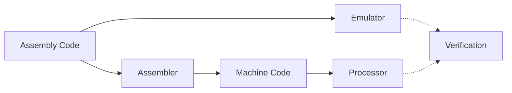

# TUCA (TTU Computer Architecture)


> TUCA is a complete educational computer architecture developed at Texas Tech University - Costa Rica by Dr. Juan Carlos Rojas. It provides a full toolchain for learning computer architecture concepts, from assembly programming to hardware implementation.

## Quick Start Guide

```bash
# 1. Configure Git (Windows users, before cloning)
git config --global core.autocrlf input

# 2. Clone and setup
git clone https://github.com/yourusername/TUCA.git && cd TUCA

# 3. Create and activate virtual environment
python -m venv venv
source venv/bin/activate     # Linux/macOS
.\venv\Scripts\activate      # Windows CMD
.\venv\Scripts\Activate.ps1  # Windows PowerShell

# 4. Install dependencies
pip install -r requirements.txt

# 5. Make TUCA executable (Linux/macOS)
chmod +x scripts/tuca

# 6. Try an example program
./scripts/tuca build examples/addTwoNums  # (scripts\tuca.bat on Windows)
./scripts/tuca emu examples/addTwoNums test1
```

## TUCA CLI Reference

The `tuca` command-line tool is your primary interface to TUCA:

### Command Format

```bash
tuca <command> [options]      # Linux/macOS with tuca in PATH
./scripts/tuca <command>      # Linux/macOS direct
scripts\tuca.bat <command>    # Windows
```

### Core Commands

| Command  | Description                      | Example                       | Common Options |
| -------- | -------------------------------- | ----------------------------- | -------------- |
| `build`  | Compile assembly to machine code | `tuca build myprogram`        | None           |
| `emu`    | Run program in emulator          | `tuca emu myprogram test1`    | `--verbose`    |
| `verify` | Compare emulator vs hardware     | `tuca verify myprogram test1` | None           |
| `clean`  | Remove build artifacts           | `tuca clean myprogram`        | None           |

### Output Modes

1. **Standard Mode** (Default)

   - Shows final memory map (non-zero locations)
   - Shows verification result (✅ or ❌)
   - Perfect for automated testing and quick checks

2. **Verbose Mode** (`--verbose`)
   - Shows instruction-by-instruction execution
   - Displays register states after each instruction
   - Shows memory state changes
   - Perfect for debugging and understanding program flow

Example verbose output:

```
PC: 0x0000  Instruction: LDI R1, 0x05
Registers: R1=0x0005 R2=0x0000 ...

PC: 0x0001  Instruction: LDI R2, 0x03
Registers: R1=0x0005 R2=0x0003 ...

Final Memory State:
0x00=0x05
0x01=0x03
0x02=0x08
```

### Common Workflows

```bash
# Development cycle
tuca build myprogram
tuca emu myprogram test1
tuca emu myprogram test1 --verbose  # Debug mode

# Batch testing
tuca emu myprogram all
tuca verify myprogram all

# Cleanup
tuca clean              # Clean all build artifacts
tuca clean myprogram    # Clean specific program
```

## Architecture Overview

TUCA is designed as an educational architecture demonstrating key concepts in computer organization:

- **Simple but Complete ISA**: Essential instructions for computation and control flow
- **Memory-Mapped I/O**: Hardware-software interface concepts
- **Pipeline Implementation**: Modern processor design principles
- **Verification Framework**: Comparison between emulation and hardware

### Component Pipeline



### 🔧 Assembler

Converts TUCA assembly code into machine code:

- Full TUCA-5.1 instruction set support
- Label resolution and error checking
- Generates memory initialization files
- Used by both emulator and processor

### 💻 Emulator

Software implementation of the TUCA processor:

- Direct assembly code interpretation
- Interactive debugging capabilities
- Cycle-accurate execution
- Memory and register visualization

### ⚡ Processor

Hardware implementation in Verilog:

- 5-stage pipeline architecture
- Harvard memory architecture
- Hazard detection and forwarding
- Synthesizable for FPGA

## System Requirements

- Python 3.8 or higher
- Git
- Operating System:
  - Linux/macOS: Any recent version
  - Windows: Windows 10/11 with either:
    - Windows Subsystem for Linux (WSL) - Recommended
    - Native Windows (using `tuca.bat`)

## Installation Details

### 1. Repository Setup

```bash
# Clone the repository
git clone https://github.com/yourusername/TUCA.git
cd TUCA
```

### 2. Python Environment

```bash
# Create virtual environment
python -m venv venv

# Activate (system-specific):
source venv/bin/activate     # Linux/macOS
.\venv\Scripts\activate      # Windows CMD
.\venv\Scripts\Activate.ps1  # Windows PowerShell

# Install dependencies
pip install -r requirements.txt
```

### 3. Tool Configuration

Linux/macOS:

```bash
# Make executable
chmod +x scripts/tuca

# Test installation
./scripts/tuca --help
```

Windows:

```cmd
# Test installation
scripts\tuca.bat --help
```

### 4. Optional: Add to PATH

Linux/macOS:

```bash
# Add to ~/.bashrc or ~/.zshrc
export PATH="/absolute/path/to/TUCA/scripts:$PATH"
source ~/.bashrc  # or ~/.zshrc
```

Windows:

```powershell
# Via PowerShell
$env:Path += ";C:\path\to\TUCA\scripts"

# Or via System Settings:
# Control Panel > System > Advanced System Settings > Environment Variables
# Add full path to TUCA\scripts to PATH
```

## Project Structure

```
TUCA/
├── Pipeline/          # Core TUCA implementation
│   ├── Assembler/    # Assembly to machine code
│   │   └── src/      # Assembler source code
│   ├── Emulator/     # Software implementation
│   │   └── src/      # Emulator source code
│   └── Processor/    # Hardware implementation
│       ├── src/      # Verilog source files
│       └── testbench/# Verilog testbenches
├── Programs/          # Assembly programs and tests
│   └── example1/     # Example program
│       ├── prog.txt      # Assembly program
│       ├── config.json   # Test configuration
│       ├── test_mems/    # Test memory files
│       │   ├── test1.txt # Initial memory state for test1
│       │   └── test2.txt # Initial memory state for test2
│       ├── build/        # Build artifacts
│       │   └── prog.mem  # Compiled program
│       └── results/      # Test results
│           ├── emulator/ # Emulator results
│           ├── verilog/  # Verilog results
│           └── verify/   # Verification reports
├── Examples/         # Example programs
├── Docs/            # Documentation
└── scripts/         # Build and test tools
    ├── build.py     # Build system
    ├── verify.py    # Result verification
    └── tuca         # Command-line interface
```

## Program Development

### Program Structure

Each TUCA program requires:

```
myprogram/
├── prog.txt         # Assembly code
├── config.json      # Test configuration
└── test_mems/       # Test memory files
    └── test1.txt    # Initial memory state
```

### Test Memory Files

Test memory files (`test_mems/*.txt`) specify initial memory state:

- Values in hexadecimal with `0x` prefix
- Values must come before any comments
- Each line = sequential memory location from 0x00
- Comments start with `#`

Example (`test1.txt`):

```
0x05    # memory[0x00]
0x03    # memory[0x01]
# Values must come before comments
```

❗ Important: Comments/empty lines at file start count as 0x00 memory locations.

### Test Configuration

`config.json` specifies test cases and expected results:

```json
{
  "program": "prog.txt",
  "test_cases": [
    {
      "name": "test1",
      "description": "Add two numbers: 5 + 3 = 8",
      "memory": "test_mems/test1.txt",
      "expected": {
        "memory": {
          "0x02": "0x08"
        }
      }
    }
  ]
}
```

## Build System Output

The build system generates three types of results:

1. **Emulator Results** (`results/emulator/`)

   ```
   0x02=0x42  # memory[0x02] = 0x42
   0x03=0xFF  # memory[0x03] = 0xFF
   ```

2. **Verilog Results** (`results/verilog/`)

   - Same format as emulator output
   - Used for comparison

3. **Verification Reports** (`results/verify/`)
   - Compares emulator vs Verilog
   - Shows expected values
   - Marks mismatches (❌) and matches (✅)

## Troubleshooting

### Common Issues

1. **Python Environment**

   - Check Python version: `python --version`
   - Verify virtual env: Look for `(venv)` in prompt
   - Check dependencies: `pip list`

2. **Permission Issues**

   - Linux/macOS: `chmod +x scripts/tuca`
   - Check file ownership/permissions

3. **Path Issues**
   - Verify PATH configuration
   - Use absolute paths if needed
   - Check for spaces in paths

### Getting Help

- Review [Documentation](Docs/)
- Check [Example Programs](Examples/)
- File GitHub issues
- Contact development team

## Documentation

- [Assembler Documentation](Pipeline/Assembler/README.md)
- [Emulator Documentation](Pipeline/Emulator/README.md)
- [Processor Documentation](Pipeline/Processor/README.md)
- [Architecture Specification](Docs/architecture.md)
- [Assembly Language Reference](Docs/assembly.md)
- [Contributing Guidelines](CONTRIBUTING.md)
- [Change Log](CHANGELOG.md)

## Authors

- **Dr. Juan Carlos Rojas** - _Initial Design and Development_
- **Andres Antillon** - _Emulator Modifications and Build System_

## Contributing

[Add contribution guidelines here]

## License

[Add license information here]
