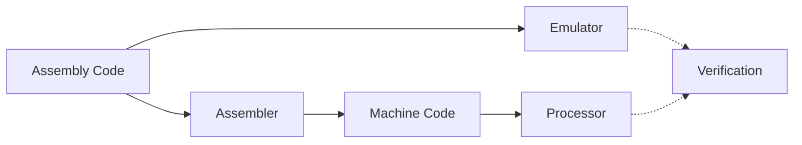

# TUCA (TTU Computer Architecture)


> TUCA is a complete educational computer architecture developed at Texas Tech University - Costa Rica by Dr. Juan Carlos Rojas. It provides a full toolchain for learning computer architecture concepts, from assembly programming to hardware implementation.

## Quick Start Guide

### Prerequisites

- Python 3.8 or higher
- Git
- VS Code (recommended) with TUCA Assembly extension

### Step-by-Step Setup

#### 1. Clone Repository (in Terminal/CMD)

Open your terminal or command prompt and run:

```bash
# Windows users only: Configure Git first
git config --global core.autocrlf input

# Clone repository
git clone https://github.com/yourusername/TUCA.git
cd TUCA
```

#### 2. Open in Editor

- Open VS Code
- File > Open Folder > Select the TUCA folder you just cloned
- Open the integrated terminal in VS Code (View > Terminal)
  - Or continue using your standalone terminal

#### 3. Setup Python Environment (in Terminal)

```bash
# Create virtual environment
# For Windows:
python -m venv venv
# For macOS/Linux:
python3 -m venv venv

# Activate virtual environment
# For Windows CMD:
.\venv\Scripts\activate
# For Windows PowerShell:
.\venv\Scripts\Activate.ps1
# For macOS/Linux:
source venv/bin/activate

# Install dependencies
pip install -r requirements.txt
```

#### 4. Setup TUCA CLI (in Terminal)

```bash
# For macOS/Linux only:
chmod +x scripts/tuca

# Verify installation
# For Windows:
scripts\tuca.bat --help
# For macOS/Linux:
./scripts/tuca --help
```

#### Optional: Add TUCA to PATH (Unix/macOS)

This allows you to run `tuca` directly instead of using `./scripts/tuca`:

```bash
# Add to your shell's rc file (~/.bashrc or ~/.zshrc):
echo 'export PATH="$PATH:$PWD/scripts"' >> ~/.bashrc  # or ~/.zshrc
source ~/.bashrc  # or ~/.zshrc

# Verify it works
tuca --help
```

Note: The above commands add the current directory's scripts folder to PATH. If you move the TUCA folder, you'll need to update the PATH.

#### 5. Try an Example (in Terminal)

```bash
# For Windows:
scripts\tuca.bat emu examples\addTwoNums     # Run all tests

# For macOS/Linux:
./scripts/tuca emu examples/addTwoNums       # If running directly
tuca emu examples/addTwoNums                 # If TUCA is in PATH

# Try with verbose output to see execution details
scripts\tuca.bat emu examples\addTwoNums --verbose  # Windows
./scripts/tuca emu examples/addTwoNums --verbose    # macOS/Linux direct
tuca emu examples/addTwoNums --verbose             # macOS/Linux with PATH
```

Note: All program paths are relative to the `Programs/` directory. For example:

- `examples/addTwoNums` → `Programs/examples/addTwoNums`
- `someProgram` → `Programs/someProgram`

### Program Directory Structure

```
your_program/
├── prog.txt           # Your assembly program
├── config.json        # Test configuration file
└── test_mems/        # Directory containing test memory files
    ├── mem1.txt      # Test case 1 initial memory
    ├── mem2.txt      # Test case 2 initial memory
    └── ...
```

### Required Files Format

1. `config.json` (Minimum required structure):

```json
{
  "program": "prog.txt",
  "test_cases": [
    {
      "name": "mem1",
      "memory": "test_mems/mem1.txt",
      "expected": {
        "memory": {
          "0x02": "0x05" // Expected value at memory location
        }
      }
    }
  ]
}
```

2. `test_mems/mem1.txt` (Memory file format):

```
0x05    # Values must come before comments
0x03    # Each line = sequential memory location
```

### Common Commands

```bash
# Run all tests in a program (default behavior)
scripts\tuca.bat emu your_program     # Windows
./scripts/tuca emu your_program       # macOS/Linux direct
tuca emu your_program                 # macOS/Linux with PATH

# Run a specific test (when needed)
scripts\tuca.bat emu your_program mem1  # Windows
./scripts/tuca emu your_program mem1    # macOS/Linux direct
tuca emu your_program mem1              # macOS/Linux with PATH

# Run with verbose output (shows execution details)
scripts\tuca.bat emu your_program --verbose  # Windows
./scripts/tuca emu your_program --verbose    # macOS/Linux direct
tuca emu your_program --verbose              # macOS/Linux with PATH
```

### Troubleshooting Common Issues

1. **Repository Setup Issues**

   - Ensure Git is installed and configured
   - Check repository permissions
   - Verify you're using the correct repository URL

2. **Python Environment Issues**

   - Verify Python version: `python --version`
   - Ensure virtual environment is activated (look for `(venv)` in prompt)
   - Check if all dependencies are installed: `pip list`

3. **Program Directory Not Found**

   - Ensure you're in the TUCA root directory
   - Check that your program directory is in `Programs/`
   - Directory name is case-sensitive

4. **Config File Error**

   - Ensure `config.json` exists in your program directory
   - Verify JSON syntax is correct
   - Check that test memory files exist in `test_mems/`

5. **Memory File Format**

   - Values must be in hex format with `0x` prefix
   - Comments must come after values
   - Each line represents sequential memory locations

6. **Windows Path Issues**
   - Use backslashes (`\`) in paths
   - Enclose paths with spaces in quotes
   - Run from TUCA root directory

## TUCA CLI Reference

The `tuca` command-line tool is your primary interface to TUCA:

### Command Format

```bash
tuca <command> [options]      # Linux/macOS with tuca in PATH
./scripts/tuca <command>      # Linux/macOS direct
scripts\tuca.bat <command>    # Windows
```

### Core Commands

| Command  | Description                      | Example                       | Common Options |
| -------- | -------------------------------- | ----------------------------- | -------------- |
| `build`  | Compile assembly to machine code | `tuca build myprogram`        | None           |
| `emu`    | Run program in emulator          | `tuca emu myprogram test1`    | `--verbose`    |
| `verify` | Compare emulator vs hardware     | `tuca verify myprogram test1` | None           |
| `clean`  | Remove build artifacts           | `tuca clean myprogram`        | None           |

### Output Modes

1. **Standard Mode** (Default)

   - Shows final memory map (non-zero locations)
   - Shows verification result (✅ or ❌)
   - Perfect for automated testing and quick checks

2. **Verbose Mode** (`--verbose`)
   - Shows instruction-by-instruction execution
   - Displays register states after each instruction
   - Shows memory state changes
   - Perfect for debugging and understanding program flow

Example verbose output:

```
PC: 0x0000  Instruction: LDI R1, 0x05
Registers: R1=0x0005 R2=0x0000 ...

PC: 0x0001  Instruction: LDI R2, 0x03
Registers: R1=0x0005 R2=0x0003 ...

Final Memory State:
0x00=0x05
0x01=0x03
0x02=0x08
```

### Common Workflows

```bash
# Development cycle
tuca build myprogram
tuca emu myprogram test1
tuca emu myprogram test1 --verbose  # Debug mode

# Batch testing
tuca emu myprogram all
tuca verify myprogram all

# Cleanup
tuca clean              # Clean all build artifacts
tuca clean myprogram    # Clean specific program
```

## Architecture Overview

TUCA is designed as an educational architecture demonstrating key concepts in computer organization:

- **Simple but Complete ISA**: Essential instructions for computation and control flow
- **Memory-Mapped I/O**: Hardware-software interface concepts
- **Pipeline Implementation**: Modern processor design principles
- **Verification Framework**: Comparison between emulation and hardware

### Component Pipeline



### 🔧 Assembler

Converts TUCA assembly code into machine code:

- Full TUCA-5.1 instruction set support
- Label resolution and error checking
- Generates memory initialization files
- Used by both emulator and processor

### 💻 Emulator

Software implementation of the TUCA processor:

- Direct assembly code interpretation
- Interactive debugging capabilities
- Cycle-accurate execution
- Memory and register visualization

### ⚡ Processor

Hardware implementation in Verilog:

- 5-stage pipeline architecture
- Harvard memory architecture
- Hazard detection and forwarding
- Synthesizable for FPGA

## System Requirements

- Python 3.8 or higher
- Git
- Operating System:
  - Linux/macOS: Any recent version
  - Windows: Windows 10/11 with either:
    - Windows Subsystem for Linux (WSL) - Recommended
    - Native Windows (using `tuca.bat`)

## Installation Details

### 1. Repository Setup

```bash
# Clone the repository
git clone https://github.com/yourusername/TUCA.git
cd TUCA
```

### 2. Python Environment

```bash
# Create virtual environment
python -m venv venv

# Activate (system-specific):
source venv/bin/activate     # Linux/macOS
.\venv\Scripts\activate      # Windows CMD
.\venv\Scripts\Activate.ps1  # Windows PowerShell

# Install dependencies
pip install -r requirements.txt
```

### 3. Tool Configuration

Linux/macOS:

```bash
# Make executable
chmod +x scripts/tuca

# Test installation
./scripts/tuca --help
```

Windows:

```cmd
# Test installation
scripts\tuca.bat --help
```

### 4. Optional: Add to PATH

Linux/macOS:

```bash
# Add to ~/.bashrc or ~/.zshrc
export PATH="/absolute/path/to/TUCA/scripts:$PATH"
source ~/.bashrc  # or ~/.zshrc
```

Windows:

```powershell
# Via PowerShell
$env:Path += ";C:\path\to\TUCA\scripts"

# Or via System Settings:
# Control Panel > System > Advanced System Settings > Environment Variables
# Add full path to TUCA\scripts to PATH
```

## Project Structure

```
TUCA/
├── Pipeline/          # Core TUCA implementation
│   ├── Assembler/    # Assembly to machine code
│   │   └── src/      # Assembler source code
│   ├── Emulator/     # Software implementation
│   │   └── src/      # Emulator source code
│   └── Processor/    # Hardware implementation
│       ├── src/      # Verilog source files
│       └── testbench/# Verilog testbenches
├── Programs/          # Assembly programs and tests
│   └── example1/     # Example program
│       ├── prog.txt      # Assembly program
│       ├── config.json   # Test configuration
│       ├── test_mems/    # Test memory files
│       │   ├── test1.txt # Initial memory state for test1
│       │   └── test2.txt # Initial memory state for test2
│       ├── build/        # Build artifacts
│       │   └── prog.mem  # Compiled program
│       └── results/      # Test results
│           ├── emulator/ # Emulator results
│           ├── verilog/  # Verilog results
│           └── verify/   # Verification reports
├── Examples/         # Example programs
├── Docs/            # Documentation
└── scripts/         # Build and test tools
    ├── build.py     # Build system
    ├── verify.py    # Result verification
    └── tuca         # Command-line interface
```

## Program Development

### Program Structure

Each TUCA program requires:

```
myprogram/
├── prog.txt         # Assembly code
├── config.json      # Test configuration
└── test_mems/       # Test memory files
    └── test1.txt    # Initial memory state
```

### Test Memory Files

Test memory files (`test_mems/*.txt`) specify initial memory state:

- Values in hexadecimal with `0x` prefix
- Values must come before any comments
- Each line = sequential memory location from 0x00
- Comments start with `#`

Example (`test1.txt`):

```
0x05    # memory[0x00]
0x03    # memory[0x01]
# Values must come before comments
```

❗ Important: Comments/empty lines at file start count as 0x00 memory locations.

### Test Configuration

`config.json` specifies test cases and expected results:

```json
{
  "program": "prog.txt",
  "test_cases": [
    {
      "name": "test1",
      "description": "Add two numbers: 5 + 3 = 8",
      "memory": "test_mems/test1.txt",
      "expected": {
        "memory": {
          "0x02": "0x08"
        }
      }
    }
  ]
}
```

## Build System Output

The build system generates three types of results:

1. **Emulator Results** (`results/emulator/`)

   ```
   0x02=0x42  # memory[0x02] = 0x42
   0x03=0xFF  # memory[0x03] = 0xFF
   ```

2. **Verilog Results** (`results/verilog/`)

   - Same format as emulator output
   - Used for comparison

3. **Verification Reports** (`results/verify/`)
   - Compares emulator vs Verilog
   - Shows expected values
   - Marks mismatches (❌) and matches (✅)

## Troubleshooting

### Common Issues

1. **Python Environment**

   - Check Python version: `python --version`
   - Verify virtual env: Look for `(venv)` in prompt
   - Check dependencies: `pip list`

2. **Permission Issues**

   - Linux/macOS: `chmod +x scripts/tuca`
   - Check file ownership/permissions

3. **Path Issues**
   - Verify PATH configuration
   - Use absolute paths if needed
   - Check for spaces in paths

### Getting Help

- Review [Documentation](Docs/)
- Check [Example Programs](Examples/)
- File GitHub issues
- Contact development team

## Development Tools

### VS Code Extension

A dedicated Visual Studio Code extension is available for TUCA Assembly development. The extension provides syntax highlighting and language support to enhance your TUCA programming experience.

#### Features

- **Syntax Highlighting**

  - Instructions (ld, st, add, etc.) in purple/magenta
  - Registers (r0-r15) in blue
  - Labels (ending with :) in yellow/gold
  - Definitions (def statements) in purple
  - Numbers (hex and decimal) in light green
  - Comments (# lines) in green
  - Special variables (op1, op2, result, etc.) in light blue

- **Code Organization**
  - Comment support (# for line comments)
  - Code folding for labeled sections
  - Macro definition highlighting
  - Support for both hex (0x) and decimal numbers

#### Installation

1. Open VS Code
2. Press `Ctrl+P` (or `Cmd+P` on macOS)
3. Paste the following command:
   ```
   ext install axantillon.tuca-assembly-syntax
   ```
4. Press Enter

The syntax highlighting will automatically activate for any `.txt` file containing TUCA assembly code.

[Get it from VS Code Marketplace](https://marketplace.visualstudio.com/items?itemName=axantillon.tuca-assembly-syntax)

## Documentation

- [Assembler Documentation](Pipeline/Assembler/README.md)
- [Emulator Documentation](Pipeline/Emulator/README.md)
- [Processor Documentation](Pipeline/Processor/README.md)
- [Architecture Specification](Docs/architecture.md)
- [Assembly Language Reference](Docs/assembly.md)
- [Contributing Guidelines](CONTRIBUTING.md)
- [Change Log](CHANGELOG.md)

## Authors

- **Dr. Juan Carlos Rojas** - _Initial Design and Development_
- **Andres Antillon** - _Emulator Modifications and Build System_

## Contributing

[Add contribution guidelines here]

## License

This project is licensed under the MIT License - see the [LICENSE](LICENSE) file for details.
