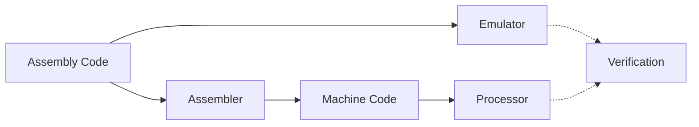

# TUCA (TTU Computer Architecture)


TUCA is a complete educational computer architecture developed at Texas Tech University - Costa Rica by Dr. Juan Carlos Rojas. It provides a full toolchain for learning computer architecture concepts, from assembly programming to hardware implementation.

## Pipeline Overview

The TUCA architecture is implemented through three main components that work together to form a complete development and verification pipeline:



### 🔧 [Assembler](Pipeline/Assembler/)

Converts TUCA assembly code into machine code:

- Full TUCA-5.1 instruction set support
- Label resolution and error checking
- Generates memory initialization files
- Used by both emulator and processor

### 💻 [Emulator](Pipeline/Emulator/)

Software implementation of the TUCA processor:

- Direct assembly code interpretation
- Interactive debugging capabilities
- Cycle-accurate execution
- Memory and register visualization

### ⚡ [Processor](Pipeline/Processor/)

Hardware implementation in Verilog:

- 5-stage pipeline architecture
- Harvard memory architecture
- Hazard detection and forwarding
- Synthesizable for FPGA

## Key Features

- **Complete Architecture Implementation**
  - 16-bit RISC architecture
  - 16 general-purpose registers
  - Memory-mapped I/O support
  - Pipeline implementation in Verilog
- **Development Tools**
  - Unified build system
  - Automated testing framework
  - Interactive debugging
  - Performance analysis
- **Educational Resources**
  - Example programs
  - Step-by-step tutorials
  - Comprehensive documentation
  - Verification framework

## TUCA Architecture Overview

TUCA is designed as an educational architecture that demonstrates key concepts in computer organization:

- **Simple but Complete ISA**: Includes essential instructions for computation and control flow
- **Memory-Mapped I/O**: Demonstrates hardware-software interface concepts
- **Pipeline Implementation**: Shows modern processor design principles
- **Verification Framework**: Enables comparison between emulation and hardware implementation

## Setup

### Prerequisites

- Python 3.8 or higher
- Git
- Operating System:
  - Linux/macOS: Any recent version
  - Windows: Windows 10/11 with either:
    - Windows Subsystem for Linux (WSL) - Recommended
    - Native Windows (using `tuca.bat`)

### Installation

1. **Clone the Repository**:

   ```bash
   git clone https://github.com/yourusername/TUCA.git
   cd TUCA
   ```

   Note: The repository uses Git's line ending handling to ensure consistent behavior across platforms.
   On Windows, you may want to configure Git to maintain line endings:

   ```bash
   # Configure Git (before cloning)
   git config --global core.autocrlf input
   ```

2. **Set Up Python Environment**:

   ```bash
   # Create a virtual environment
   python -m venv venv

   # Activate it (choose one based on your system):
   source venv/bin/activate     # Linux/macOS
   .\venv\Scripts\activate      # Windows CMD
   .\venv\Scripts\Activate.ps1  # Windows PowerShell

   # Install dependencies
   pip install -r requirements.txt
   ```

3. **Configure the Tool**:

   On Linux/macOS:

   ```bash
   # Make the tuca script executable
   chmod +x scripts/tuca

   # Test the installation
   ./scripts/tuca --help
   ```

   On Windows:

   ```cmd
   # Test the installation (CMD or PowerShell)
   scripts\tuca.bat --help
   ```

4. **Optional: Add to PATH**:

   To run the `tuca` command from any directory:

   On Linux/macOS:

   ```bash
   # Add to your ~/.bashrc, ~/.zshrc, or equivalent
   export PATH="/absolute/path/to/TUCA/scripts:$PATH"
   source ~/.bashrc  # or ~/.zshrc
   ```

   On Windows:

   ```cmd
   # Add to your system environment variables:
   # Control Panel > System > Advanced System Settings > Environment Variables
   # Add the full path to TUCA\scripts to your PATH
   # Or from PowerShell:
   $env:Path += ";C:\path\to\TUCA\scripts"
   ```

### Verifying Installation

After installation, you should be able to:

1. Run the help command:
   ```bash
   ./scripts/tuca --help      # Linux/macOS
   scripts\tuca.bat --help    # Windows
   # Or if added to PATH:
   tuca --help               # Linux/macOS
   tuca.bat --help          # Windows
   ```
2. See the list of available commands
3. Access the example programs in the `Programs` directory

If you encounter any issues, please check:

- Python version: `python --version`
- Virtual environment is activated (you should see `(venv)` in your prompt)
- All dependencies are installed: `pip list`
- On Windows, ensure you're using the correct script (`tuca.bat`)
- On Linux/macOS, ensure `scripts/tuca` has execute permissions

## Project Structure

```
TUCA/
├── Pipeline/          # Core TUCA implementation
│   ├── Assembler/    # Assembly to machine code
│   │   └── src/      # Assembler source code
│   ├── Emulator/     # Software implementation
│   │   └── src/      # Emulator source code
│   └── Processor/    # Hardware implementation
│       ├── src/      # Verilog source files
│       └── testbench/# Verilog testbenches
├── Programs/          # Assembly programs and tests
│   └── example1/     # Example program
│       ├── prog.txt      # Assembly program
│       ├── config.json   # Test configuration
│       ├── test_mems/    # Test memory files
│       │   ├── test1.txt
│       │   └── test2.txt
│       ├── build/        # Build artifacts
│       │   └── prog.mem      # Compiled program
│       └── results/      # Test results
│           ├── emulator/     # Emulator results
│           │   └── test1.txt
│           ├── verilog/      # Verilog results
│           │   └── test1.txt
│           └── verify/       # Verification reports
│               └── test1.txt
├── Examples/         # Example programs
├── Docs/            # Documentation
└── scripts/         # Build and test tools
    ├── build.py     # Build system
    ├── verify.py    # Result verification
    └── tuca         # Command-line interface
```

## Quick Start

1. **Create a New Program**:

   Create a new directory for your program with this structure:

   ```
   Programs/
   └── example1/           # Your program directory
       ├── prog.txt        # Your assembly program
       ├── config.json     # Test configuration
       └── test_mems/      # Test memory files
           └── test1.txt   # Initial memory state
   ```

   You can create this structure:

   - Using your file explorer
   - Using command line:

     ```bash
     # Linux/macOS
     mkdir -p Programs/example1/test_mems

     # Windows (CMD)
     mkdir Programs\example1\test_mems
     ```

2. **Write Your Program**:

   Create `Programs/example1/prog.txt` using any text editor and write your TUCA assembly code.

3. **Configure Tests**:

   Create `Programs/example1/config.json`:

   ```json
   {
     "program": "prog.txt",
     "test_cases": [
       {
         "name": "test1",
         "memory": "test_mems/test1.txt",
         "expected": {
           "memory": {
             "0x02": "0x10"
           }
         }
       }
     ]
   }
   ```

4. **Build and Test**:

   Linux/macOS:

   ```bash
   ./scripts/tuca build example1
   ./scripts/tuca emu example1 test1
   ```

   Windows:

   ```cmd
   scripts\tuca.bat build example1
   scripts\tuca.bat emu example1 test1
   ```

   Or if `tuca` is in your PATH:

   ```bash
   tuca build example1
   tuca emu example1 test1     # Linux/macOS
   tuca.bat emu example1 test1 # Windows
   ```

## Build System

The `tuca` command provides a unified interface for all development tasks:

### Building Programs

Linux/macOS:

```bash
./scripts/tuca build example1          # Build program
# Or if in PATH:
tuca build example1
```

Windows:

```cmd
scripts\tuca.bat build example1
# Or if in PATH:
tuca.bat build example1
```

### Running Tests

Linux/macOS:

```bash
./scripts/tuca emu example1 test1      # Run specific test (minimal output)
./scripts/tuca emu example1 test1 --verbose  # Show detailed execution trace
./scripts/tuca emu example1 all        # Run all tests
```

Windows:

```cmd
scripts\tuca.bat emu example1 test1
scripts\tuca.bat emu example1 test1 --verbose
scripts\tuca.bat emu example1 all
```

The emulator has two operating modes:

1. **Minimal Mode** (Default):

   - Shows final memory map
   - Shows verification result (✅ or ❌)
   - Perfect for automated testing and quick checks

2. **Verbose Mode** (with --verbose):
   - Shows full instruction execution trace
   - Shows register state after each instruction
   - Shows final memory map
   - Perfect for debugging and understanding program flow

Both modes will display:

- The final memory map showing all non-zero memory locations
- Test verification results when running against test cases
- Any errors or issues encountered during execution

### Verifying Results

Linux/macOS:

```bash
./scripts/tuca verify example1 test1   # Compare emulator vs Verilog
```

Windows:

```cmd
scripts\tuca.bat verify example1 test1
```

### Cleaning Build Artifacts

Linux/macOS:

```bash
./scripts/tuca clean              # Clean all
./scripts/tuca clean example1     # Clean specific program
```

Windows:

```cmd
scripts\tuca.bat clean
scripts\tuca.bat clean example1
```

## Test Results

The build system generates three types of results:

1. **Emulator Results** (`results/emulator/`):

   - Output from running program through emulator
   - Format: `0xAA=0xBB` (hex addresses and values)

   ```
   0x02=0x42  # memory[0x02] = 0x42
   0x03=0xFF  # memory[0x03] = 0xFF
   ```

2. **Verilog Results** (`results/verilog/`):

   - Output from Verilog simulation
   - Same format as emulator for easy comparison

3. **Verification Reports** (`results/verify/`):
   - Detailed comparison of emulator vs Verilog
   - Shows expected values from config.json
   - Highlights any mismatches with ❌
   - Shows ✅ when all values match

## Documentation

- [Assembler Documentation](Pipeline/Assembler/README.md)
- [Emulator Documentation](Pipeline/Emulator/README.md)
- [Processor Documentation](Pipeline/Processor/README.md)

## Authors

- **Dr. Juan Carlos Rojas** - _Initial Design and Development_
- **Andres Antillon** - _Emulator Modifications and Build System_

## Contributing

[Add contribution guidelines here]

## License

[Add license information here]

## Troubleshooting

### Common Issues

1. **Python Environment Problems**

   - Ensure Python 3.8+ is installed: `python --version`
   - Virtual environment is active (look for `(venv)` in prompt)
   - All dependencies are installed: `pip list`

2. **Permission Issues**

   - On Linux/macOS: `chmod +x scripts/tuca`
   - Check file ownership and permissions

3. **Path Issues**
   - Verify PATH configuration
   - Use absolute paths if needed
   - Check for spaces in directory names

### Getting Help

- Check the [Documentation](Docs/)
- Review [Example Programs](Examples/)
- File an issue on GitHub
- Contact the development team

## Additional Resources

- [TUCA Architecture Specification](Docs/architecture.md)
- [Assembly Language Reference](Docs/assembly.md)
- [Contributing Guidelines](CONTRIBUTING.md)
- [Change Log](CHANGELOG.md)
